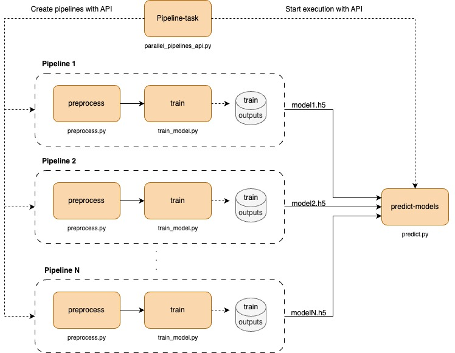

# Parallel Pipelines with API
Welcome to our repository, where we demonstrate how to create and manage multiple parallel pipelines using API calls. Our focus is on enabling the execution of several pipelines with varying parameters, retrieving the outputs from these executions (specifically, trained models), and making predictions with these trained models.

## Overview
The core of our project is a basic pipeline template that includes two essential steps:

- Data preprocessing (_preprocess.py_)
- Model training (_train_model.py_)

Our methodology involves utilizing a script (_parallel_pipelines_api.py_) to dynamically create instances of this 
pipeline with different parameters. We orchestrate these pipelines through API calls, 
monitor their progress, and upon completion, fetch the output of the training steps. Finally, we use another script to 
predict the outcomes using the trained models.

## Configuration

In the _valohai.yaml_ set up the parameters that we'll use to start the pipelines.

### Environment Variables

Ensure that you have set the following environment variable in Valohai:

**VALOHAI_API_TOKEN:** _(you can choose another name - don’t forget to change it in the code)_
  - Create Valohai token
     - Go to your profile -> Authentication -> Manage Tokens -> Generate New Token -> Save it.
  - Add the generated token as an environment variable in Valohai. Either: 
    - Add the environment variable when creating an execution from the UI (Create Execution -> Environment Variables). The env variable are only available in the execution where it was created. 
    - Add the project environment variable (Project Settings -> "Environment Variables" tab -> Check "Secret" checkbox). In this case, the env variable will be available for all executions of the project.

## Parallel Pipelines API script

This section provides an in-depth explanation of the _parallel_pipelines_api.py_ script, which is central to creating parallel pipelines, monitoring their execution, retrieving the trained models, and executing predictions.

- **Authentication:** Utilizes a Valohai API token from an environment variable for secure API requests.

- **Creating Pipelines:** Iterates over combinations of datasets (harbors) and epochs, updating and creating pipelines through POST requests to Valohai.

- **Monitoring and Completion:** Periodically checks the status of each pipeline, ensuring all are completed before proceeding.

- **Prediction Execution:** After all pipelines complete, compiles training execution IDs and triggers a prediction execution with a final POST request.

## Predictions Script
The _predict.py_ script is designed to automate the prediction process by leveraging trained models and test datasets. Here's a quick rundown of its functionality:

- **Output File Download:** Initially, the script downloads model output files from specified execution IDs, utilizing the Valohai API for secure access.
- **Model Predictions:** The script loads models to predict ship categories in test datasets, then selects and saves a subset of images with their predicted categories for review.