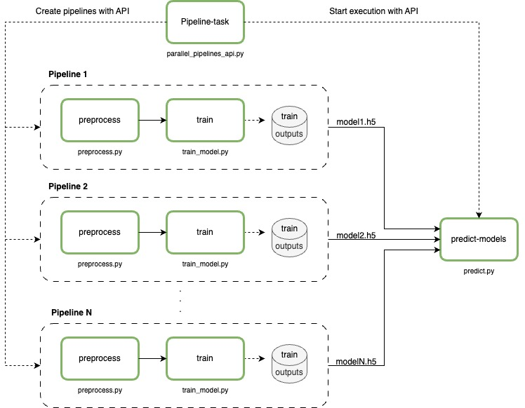
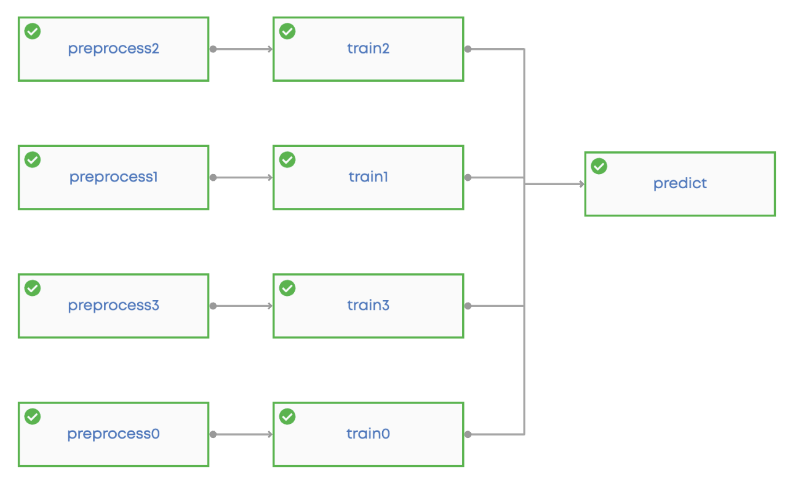
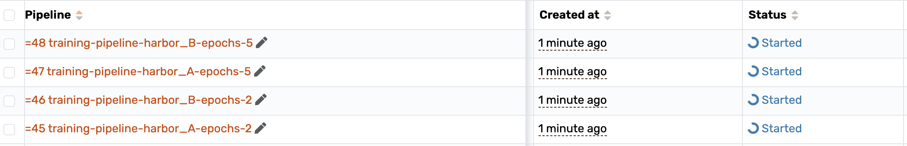

# Parallel Pipelines with API

Welcome to our repository, where we show two main ways to use API calls for managing machine learning tasks. First, we demonstrate how to set up and run several parallel pipelines. Each pipeline can have different settings, allowing us to handle various tasks, get trained models from these processes, and then use these models to make predictions.

Building on this, our second method, highlighted in the single_pipeline_api.py script, offers a simpler, unified approach. In this method, we create one big pipeline that does the job of many smaller ones. This pipeline automatically adjusts to include steps for preparing data and training models based on the input parameters, and finishes with a step that brings all the models together to make predictions.
## Overview
The core of our project is a basic pipeline template that includes two essential steps:

- Data preprocessing (_preprocess.py_)
- Model training (_train_model.py_)

<p align="center">

</p>

Our methodology involves utilizing a script (`parallel_pipelines_api.py`) to dynamically create instances of this 
pipeline with different parameters. We orchestrate these pipelines through API calls, 
monitor their progress, and upon completion, fetch the output of the training steps. Finally, we use another script to 
predict the outcomes using the trained models.

<p align="center">

</p>

Our second approach introduces the creation of a unified, extensive pipeline via the API, which flexibly adjusts its node count based on the provided parameters. This functionality is showcased in the `single_pipeline_api.py` script.
Keep in mind that this pipeline isn’t set up in the `valohai.yaml`. Instead, we show how to build any pipeline directly using the API in this example.
<p align="center">

</p>


## Configuration

In the _valohai.yaml_ set up the parameters that we'll use to start the pipelines.

### Environment Variables

Ensure that you have set the following environment variable in Valohai:

**VALOHAI_API_TOKEN:** _(you can choose another name - don’t forget to change it in the code)_
  - Create Valohai token
     - Go to your profile -> Authentication -> Manage Tokens -> Generate New Token -> Save it.
  - Add the generated token as an environment variable in Valohai. Either: 
    - Add the environment variable when creating an execution from the UI (Create Execution -> Environment Variables). The env variable are only available in the execution where it was created. 
    - Add the project environment variable (Project Settings -> "Environment Variables" tab -> Check "Secret" checkbox). In this case, the env variable will be available for all executions of the project.

## Getting started

Follow these steps to get up and running with this project:

1. **Clone the Repository:**
   
   Start by cloning this repository to your local machine:
```
git clone https://github.com/valohai/parallel-pipelines-api-example.git .
```

2. **Set Up Valohai Project:**
- Sign in to [Valohai](https://app.valohai.com) and create a new project.

3. **Configure Project Settings:**

Navigate to `utils/api_jsons.py` in your project folder and update the following fields with your project details:
- `"project": "<your-project-id>"`
- `"environment": "<your-environment-id-if-required>"`

You will also need to change these in the `single_pipeline_api.py`.

4. **Run the Code on Valohai:**

You have two options to execute your code on Valohai:

- **Publish to GitHub:**
  - Go to Valohai project settings -> Repository -> Add the URL -> Click 'Save'.
  - Navigate to Executions -> Create Execution -> Select 'pipeline-task' -> Click 'Create execution'.

- **Ad-hoc Execution:**
  - Open your terminal and execute `vh link` to link your local repository with Valohai.
  - Select your project, then run:
    ```
    vh exec run pipeline-task --adhoc
    ```

## Parallel Pipelines API script

This section provides an in-depth explanation of the _parallel_pipelines_api.py_ script, which is central to creating parallel pipelines, monitoring their execution, retrieving the trained models, and executing predictions.

- **Authentication:** Utilizes a Valohai API token from an environment variable for secure API requests.

- **Creating Pipelines:** Iterates over combinations of datasets (harbors) and epochs, updating and creating pipelines through POST requests to Valohai.
<p align="center">

</p>

- **Monitoring and Completion:** Periodically checks the status of each pipeline, ensuring all are completed before proceeding.

- **Prediction Execution:** After all pipelines complete, compiles training execution IDs and triggers a prediction execution with a final POST request.

## Single Pipeline API script
Creates one large pipeline, the number of nodes is dynamic it depends on the parameters that are passed to the single_pipeline_api.py script.

- **Flexible Pipeline Setup:** The script creates a flexible pipeline on Valohai, changing the number of steps based on inputs like harbors and epochs. It sets up steps for both data preparation and model training, allowing for easy adjustments and scalable training.

- **Automatic Prediction:** After setting up for data prep and training, the script adds a final step for predictions, linking it to all the training steps. This ensures that after training, it automatically moves on to make predictions with the trained models.

## Predictions Script
The _predict.py_ script is designed to automate the prediction process by leveraging trained models and test datasets. Here's a quick rundown of its functionality:

- **Output File Download:** Initially, the script downloads model output files from specified execution IDs, utilizing the Valohai API for secure access.
- **Model Predictions:** The script loads models to predict ship categories in test datasets, then selects and saves a subset of images with their predicted categories for review.

If you have any questions or suggestions feel free to contact us _**support@valohai.com**_.